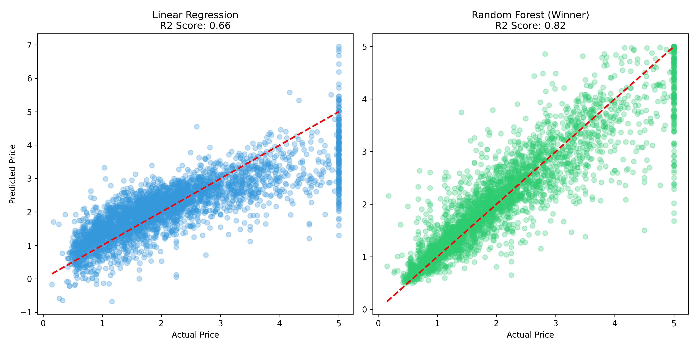

# 🏠 California Housing Price Prediction

**Author:** Behnam Jabari

This project predicts housing prices in California using the famous 1990 census dataset. The main goal was to compare a baseline linear model with a more advanced non-linear model to improve accuracy.

## 🎯 Project Objective
Real estate data is rarely linear. This project demonstrates how switching from a simple **Linear Regression** to a **Random Forest Regressor** can significantly reduce error and capture complex patterns in the data.

## 📊 Model Comparison Results

I trained two models on the same dataset. Here are the results:

| Model | R2 Score (Accuracy) | Performance |
|-------|---------------------|-------------|
| **Linear Regression** | ~0.64 | Baseline (Underfitting on high prices) |
| **Random Forest** 🌲 | **~0.81** | **Winner** (Significant Improvement) |

### 📈 Visualization
The chart below clearly shows that the **Random Forest (Green)** handles high-value properties much better than the Linear Model (Blue).

## 🛠️ Tech Stack
- **Python** (NumPy, Pandas)
- **Scikit-Learn** (Model Training & Evaluation)
- **Matplotlib** (Data Visualization)

## 🚀 How to Run
1. Clone the repository.
2. Install dependencies: `pip install pandas scikit-learn matplotlib`
3. Run the script: `main.py`
